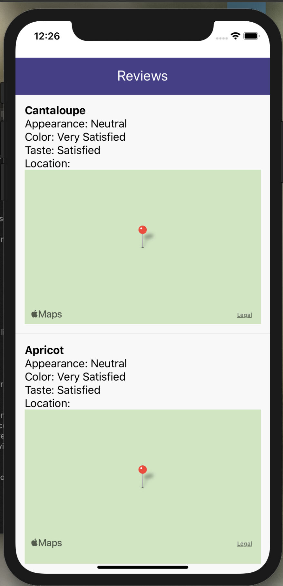

# Mobile App - Reviews

## Descripción

Mobile App 
Permite la visualización de una lista con la información recibida de parte del servidor.
- La aplicación escucha el evento `new-review` del canal `review-channel`

## Instalar

`npm install`
Instalación de dependencias

## Scripts Disponibles

En el directorio del proyecto, puede ejecutar:

`npx react-native run-ios`

Ejecuta la aplicación. 
Se muestra en el emulador. 